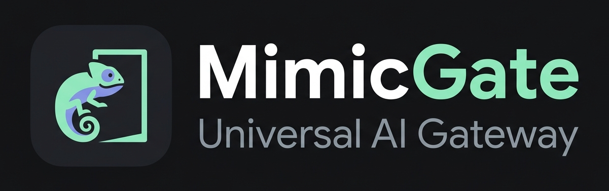

<p align="center">
  
</p>

<h1 align="center">MimicGate</h1>

<p align="center">
  <strong>A browser-backed, multi-protocol AI gateway for ChatGPT, Claude, Gemini, and MiniMax.</strong><br />
  Connect OpenAI, Anthropic, Ollama, LangChain, Cline, and self-hosted clients to one persistent gateway.
</p>

<p align="center">
  <a href="https://github.com/TheBadFella/MimicGate/releases/latest"></a>
  <a href="https://github.com/TheBadFella/MimicGate/pkgs/container/mimicgate"></a>
  <a href="LICENSE"></a>
</p>

<p align="center">
  <a href="#quick-start">Quick Start</a> ·
  <a href="#key-capabilities">Features</a> ·
  <a href="#providers">Providers</a> ·
  <a href="#parallelization-and-tab-lifecycle">Concurrency</a> ·
  <a href="#thread-management-and-conversation-continuity">Threads</a> ·
  <a href="#multimodal-and-image-handling">Images</a> ·
  <a href="#fork-vs-upstream">Fork vs Upstream</a> ·
  <a href="docs/README.md">Documentation</a>
</p>

---

MimicGate turns logged-in browser sessions into standard, developer-friendly API endpoints. ChatGPT, Claude, and Gemini operate through a persistent, stealth-automated browser context; MiniMax uses its official API while sharing the exact same gateway interface. It is designed for private, self-hosted developer integrations, local coding agents, and home labs.

## Key Capabilities

<table>
  <tr>
    <td width="50%" valign="top">
      <h3>🔌 Protocol Compatibility</h3>
      OpenAI Chat Completions and Responses API, Anthropic Messages, Ollama chat/generate/embed, tool calling, and SSE-compatible streaming for IDE clients like Cline and OpenCode.
    </td>
    <td width="50%" valign="top">
      <h3>⚡ Sessions and Tab Concurrency</h3>
      Multi-tab pooling, persistent <code>x-session-id</code> affinity, explicit thread targeting, asynchronous background jobs, and app-scoped conversation isolation.
    </td>
  </tr>
  <tr>
    <td width="50%" valign="top">
      <h3>🖼️ Documents and Vision</h3>
      Image inputs (URLs and base64), file uploads (PDF, text, code), multipage document extraction, JSON Schema normalization, ChatGPT/Gemini image generation, and TTS audio capture.
    </td>
    <td width="50%" valign="top">
      <h3>🛡️ Resilience and Operations</h3>
      Automated long-prompt attachment fallback, configurable model effort, robust DOM response detection, token auth, health endpoints, and a non-root jlesage GUI.
    </td>
  </tr>
</table>

> [!TIP]
> Long-prompt fallback is enabled by default. If a provider disables direct submission for oversized text, MimicGate automatically uploads the prompt as a temporary UTF-8 attachment. This flow has been validated with requests exceeding 1.4 million characters.

---

## Providers

MimicGate abstracts multiple frontier AI providers behind a single uniform interface:

| Provider | Mechanism | Primary Model ID | Capabilities and Highlights |
|---|---|---|---|
| **ChatGPT** | Persistent browser | `mimicgate-browser` (or `gpt-5.6-sol`, `gpt-5.5`, etc.) | Vision, file attachments, DALL-E image generation, read-aloud TTS capture, reasoning effort control (`low`/`medium`/`high`), project confinement (`CHATGPT_PROJECT_URL`). |
| **Claude** | Persistent browser | `claude-browser` (or `claude-3-7-sonnet`, `claude-3-5-sonnet`) | Conversational turns, vision, file attachments, structured tool calling. |
| **Gemini** | Persistent browser | `gemini-browser` (or `gemini-3.8-flash`, `gemini-3.1-pro`, etc.) | Text chat, vision, file attachments, Imagen 3 image generation, read-aloud audio capture, thinking/reasoning effort modes. |
| **MiniMax** | Official API | `MiniMax-M2.7` | Pure HTTP API proxy providing fast, non-browser completions using official provider credentials. |

---

## Parallelization and Tab Lifecycle

MimicGate manages browser concurrency through a dedicated `BrowserTabPool` coordinator, allowing multiple requests to execute in parallel without cross-session interference:

```
Incoming Request
    │
    ├─ Has session identity? (x-session-id, conversation_id, app_key)
    │     │
    │     ├─ YES: Acquire session-specific lock (serializes turns for that thread)
    │     │       Reuse existing tab OR open new worker tab and restore URL
    │     │
    │     └─ NO (Stateless / Fresh mode):
    │             Borrow idle tab from ephemeral pool OR open new worker tab
    │             Reset tab to provider base URL -> execute turn -> return to pool
    │
    └─ Bounded by MAX_CONCURRENT_REQUESTS semaphore (global concurrency cap)
```

### When are tabs reused vs created?

* **Tab Reuse (Session Affinity)**:
  When a request provides an identity (`x-session-id`, `session-id`, `x-mimicgate-app-key`, `conversation_id`, or `thread_id`), the gateway maps the request to a persistent tab dedicated to that session. The tab stays parked on the provider conversation URL, eliminating unnecessary page navigations between conversational turns.
* **New Tab Creation**:
  A new browser tab is created when a new session key arrives and no existing tab is mapped to it, or when all ephemeral tabs are busy and the system has not reached `MAX_ACTIVE_TABS`.
* **Tab Eviction and Capacity Management**:
  When active tabs reach `MAX_ACTIVE_TABS`, the pool frees resources using a clean lifecycle:
  1. It discards and closes idle ephemeral tabs first.
  2. If more space is required, it evicts idle persistent tabs using an LRU (least recently used) policy.
  3. When evicting an idle persistent tab, MimicGate saves the conversation URL so that subsequent turns for that session can reopen a tab and navigate directly back to the active thread.
* **Control Page Protection**:
  The primary browser tab (`__control__`) used for initial login and manual supervision is permanently protected and never closed by eviction routines.

---

## Thread Management and Conversation Continuity

MimicGate offers flexible ways to manage conversation state across stateless API clients and stateful browser sessions:

### Same-Thread Continuity
* **Durable ID Mapping**: Providing `conversation_id` (or the `X-MimicGate-Conversation-Id` header) binds the request to a tracked provider thread.
* **Composer Deduplication Optimization**: When continuing an existing thread, MimicGate inspects the message array and extracts only the system prompts plus the latest user turn and tool outputs (`_latest_turn_messages`). Because the browser thread already holds the previous dialog history, resending the entire transcript is omitted, preventing composer bloat and saving model context.

### Separate and Isolated Threads
* **App-Scoped Route Isolation**: Use routes prefixed with an application name, such as `/{app_name}/v1/chat/completions` (e.g. `/cline/v1/...` or `/openwebui/v1/...`). Each application namespace maintains isolated conversation state and thread contracts, preventing different tools from colliding.
* **Explicit Thread Targeting**: Clients can pass `thread_id` directly in the payload to force execution on a specific existing provider thread.
* **Fresh / Ephemeral Mode**: Sending `X-MimicGate-Thread-Mode: fresh` forces the gateway to initiate a brand-new, isolated thread that is automatically cleaned up and deleted after response delivery.

---

## Multimodal and Image Handling

MimicGate supports comprehensive vision, file upload, and image generation flows:

### 1. Vision and File Attachments (Input)
* **Standard Formats**: Supports standard OpenAI multimodal message format (`image_url` with remote `http(s)://` URLs or inline `data:image/...;base64,...` data URIs).
* **Document Uploads**: In addition to images, document attachments (`.pdf`, `.txt`, `.py`, `.csv`, `.json`, etc.) can be attached to prompts.
* **Secure Staging**: Inbound remote URLs and base64 payloads are securely staged in temporary local storage (`/tmp/mimicgate_files` or platform temporary directories), uploaded to the provider hidden file inputs via Playwright `set_input_files()`, monitored until the provider UI completes upload processing, and cleaned up immediately after request completion.
* **Structured Multipage Extraction**: Includes an optional page-by-page document extraction mode that normalizes multi-page documents into structured JSON schema outputs.

### 2. Image Generation (Output)
* **Endpoints**: Exposes standard OpenAI `/v1/images/generations` endpoints.
* **Engines**: Routes prompts directly to ChatGPT (DALL-E) or Gemini (Imagen 3).
* **Extraction**: Monitors the DOM for rendered image artifacts, extracts high-resolution generated media, and returns them as either URLs or base64 encoded strings (`b64_json`).

---

## Fork vs Upstream

Both projects share the foundational browser gateway concept: ChatGPT and Claude support, OpenAI Chat Completions, basic tool calling, vision inputs, multi-tab concurrency, and Docker deployment.

MimicGate adds extensive multi-protocol support, provider coverage, and resilience enhancements:

| Capability | MimicGate (This Repository) | Upstream (CatGPT-Gateway) |
|---|:---:|:---:|
| **Google Gemini Provider** | ✅ Browser-backed with Imagen 3 and TTS | - |
| **MiniMax Provider** | ✅ Official API integration | - |
| **OpenAI Responses API** (`/v1/responses`) | ✅ Full input/output conversion | - |
| **Anthropic Messages Adapter** (`/v1/messages`) | ✅ Full schema translation | - |
| **Ollama Compatible API** (`/api/chat`, `/api/generate`, `/api/tags`) | ✅ Full emulation | - |
| **App-Scoped Namespaces** (`/{app_name}/v1/...`) | ✅ Isolated threads and state | - |
| **Composer History Deduplication** | ✅ Automatically trims repeated turns | - |
| **Long-Prompt Attachment Fallback** | ✅ Tested up to 1.4M chars | - |
| **ChatGPT Read-Aloud Audio / TTS Capture** | ✅ Audio generation endpoint | - |
| **Configurable Reasoning Effort** | ✅ `low`, `medium`, `high` flags | - |
| **Asynchronous Jobs API** (`/v1/jobs/...`) | ✅ Background completion polling | - |
| **Structured Multipage Extraction** | ✅ Page-by-page JSON extraction | - |
| **Secure Non-Root jlesage Container** | ✅ Non-root GUI on port 5800 | - |
| **Live Multi-Tab Preview Dashboard** | - | ✅ |

<sub>Comparison verified against <a href="https://github.com/GautamVhavle/CatGPT-Gateway">upstream</a> at commit <code>1771f5b</code>.</sub>

---

## Backwards Compatibility

MimicGate is a direct evolution of the CatGPT project. Existing client setups and scripts continue to work without changes:

* The legacy `catgpt-browser` model ID is accepted and maps directly to `mimicgate-browser`.
* Custom headers `x-catgpt-app-key`, `x-catgpt-conversation-id`, and `x-catgpt-thread-mode` remain supported, with `x-mimicgate-*` taking precedence when both are supplied.
* The `catgpt` CLI command and `CatGPTApp` class import remain functional aliases.
* Legacy environment variables (`CATGPT_API_URL`, `CATGPT_API_KEY`, `CATGPT_MODEL`, etc.) are recognized as fallbacks when `MIMICGATE_*` variables are not defined.

---

## Quick Start

### 1. Clone and Configure

```bash
git clone https://github.com/TheBadFella/MimicGate.git
cd MimicGate
```

Create `.env` with your desired credentials:

```dotenv
MIMICGATE_API_KEY=your-secure-api-key
MIMICGATE_VNC_PASSWORD=your-vnc-password
MIMICGATE_USER_ID=1000
MIMICGATE_GROUP_ID=1000
```

Refer to the [generated environment reference](docs/ENVIRONMENT_VARIABLES.md) for all available options.

### 2. Start the Service

```bash
docker compose up -d
```

| Interface | URL | Purpose |
|---|---|---|
| **Browser GUI** | `http://localhost:5800` | Log into your chosen provider (ChatGPT, Claude, Gemini) once; session persists in volume. |
| **API Gateway** | `http://localhost:8650` | Standard API gateway listening for client requests. |

### 3. Send a Request

```bash
curl http://localhost:8650/v1/chat/completions \
  -H "Authorization: Bearer $MIMICGATE_API_KEY" \
  -H "Content-Type: application/json" \
  -d '{
    "model": "mimicgate-browser",
    "messages": [{"role": "user", "content": "Hello from MimicGate!"}]
  }'
```

---

## API Surfaces

| Protocol / Ecosystem | Available Endpoints |
|---|---|
| **OpenAI** | `/v1/chat/completions`, `/v1/responses`, `/v1/images/generations`, `/v1/models` |
| **Anthropic** | `/v1/messages` |
| **Ollama** | `/api/chat`, `/api/generate`, `/api/embed`, `/api/tags`, `/api/version` |
| **Cline / OpenCode** | `/cline/v1/chat/completions` (OpenAI format with simulated SSE streaming) |
| **Native Routes** | `/chat`, `/thread/{id}/chat`, `/thread/new`, `/threads`, `/status` |

---

## Essential Configuration

| Variable | Default | Purpose |
|---|---|---|
| `PROVIDER` | `chatgpt` | Active provider: `chatgpt`, `claude`, `gemini`, or `minimax`. |
| `MIMICGATE_API_KEY` | `dummy123` | Bearer token required for API requests. |
| `MIMICGATE_VNC_PASSWORD` | `mimicgate` | Password for the browser GUI at port 5800. |
| `MAX_CONCURRENT_REQUESTS` | `3` | Maximum simultaneous browser-backed requests. |
| `MAX_ACTIVE_TABS` | `5` | Maximum active tabs before LRU eviction. |
| `CHATGPT_DEFAULT_MODEL` | UI default | Preferred ChatGPT model selection. |
| `GEMINI_DEFAULT_MODEL` | `gemini-browser` | Preferred Gemini model selection. |
| `CHATGPT_LONG_PROMPT_FALLBACK` | `attachment` | Upload oversized prompts as files (`attachment` or `error`). |

Check the [Environment Variables Guide](docs/ENVIRONMENT_VARIABLES.md) for complete details.

---

## Documentation Index

Explore detailed documentation in the [docs/](docs/README.md) directory:

* [Supported Providers Overview](docs/PROVIDERS.md)
* [Installation and Setup Guide](docs/INSTALLATION_AND_SETUP.md)
* [Gemini Provider Guide](docs/GEMINI_PROVIDER_GUIDE.md)
* [API Reference and Protocol Guide](docs/API_REFERENCE.md)
* [Environment Variables Reference](docs/ENVIRONMENT_VARIABLES.md)
* [Model and Reasoning Effort Selection](docs/MODEL_AND_REASONING_SELECTION.md)
* [System Architecture and Internals](docs/SYSTEM_ARCHITECTURE.md)
* [Browser Automation Runbook](docs/BROWSER_AUTOMATION_RUNBOOK.md)
* [Testing and Verification Guide](docs/TESTING_AND_VERIFICATION.md)

---

## Credits and License

MimicGate is an extended fork of [GautamVhavle/CatGPT-Gateway](https://github.com/GautamVhavle/CatGPT-Gateway).

Released under the [MIT License](LICENSE).
